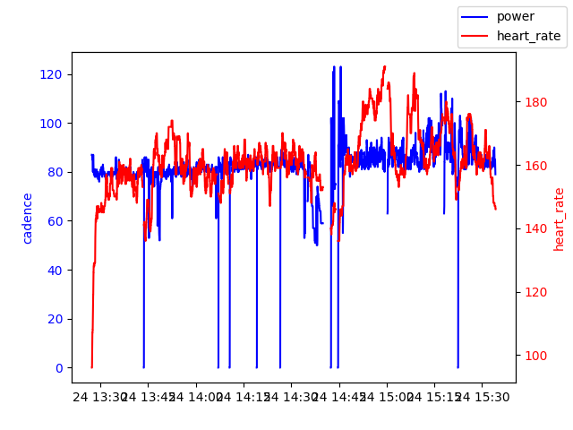
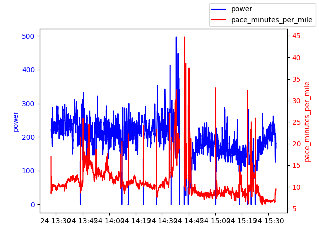

The project is for analyzing Coros FIT files from my personal trail runs. Eventually, the goal is to model average Pace based on features.

Below are some visualizations.

Bear Canyon <-> Green Mountain, Boulder

