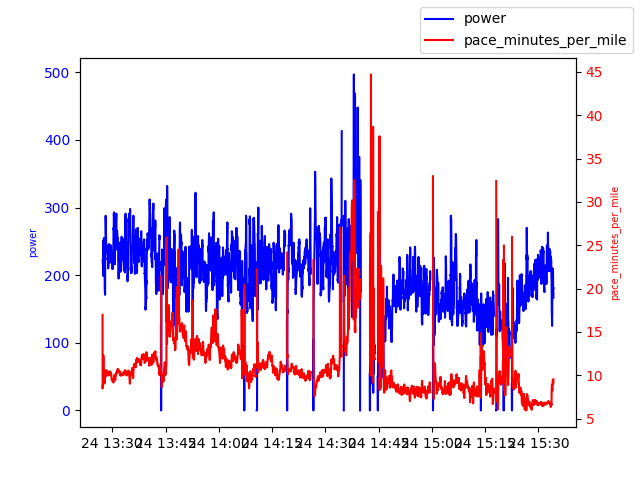

The project is for analyzing Coros FIT files from my personal trail runs. Eventually, the goal is to explore modelling around the following use cases:

* Pace based on salient features
* Heart rate response based on gradient change and cadence change

Below are some visualizations.

**Bear Canyon <-> Green Mountain, Boulder
**

**Put together in Tableau:
**

